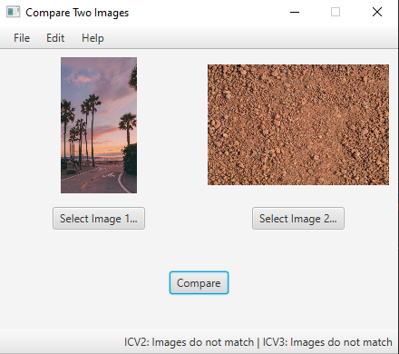

# Image Comparison Tool
Image comparison tool with JavaFX visualization

# Image Comparison Tool

 

## Getting started 
To get a local copy up and running follow these simple example steps.

### Prerequisites
This section will describe requirements needed to satisfy the installation or running of the project.

 - Java 11
 - Maven
 
### Nice to have
 - Intellij

### Build
 - `git clone https://github.com/Tanevski3/image-comparison.git`
 - `cd ./image-comparison`
 - `mvn clean install`
 
### Run
 - Right click and run `MainEntry.java`
 
### Test
 - Run `mvn test`

## Future changes
 - Implement ScreenRecorder
 - Add test coverage
 
## Contact

For contact, you can reach me at [marjantanevski@outlook.com](marjantanevski@outlook.com).

## License

MIT © [Marjan Tanevski](marjantanevski@outlook.com)